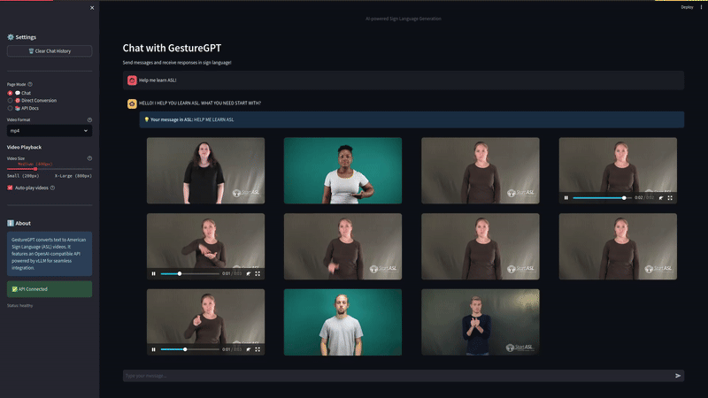
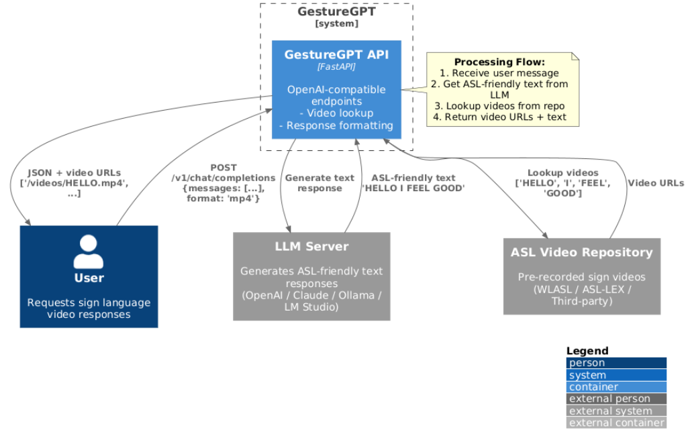

<div align="center">

# 👋 GestureGPT

### AI-Powered Sign Language Translation API



Transform text into American Sign Language (ASL) videos through an OpenAI-compatible API. GestureGPT combines LLM intelligence with ASL video generation to make sign language accessible through a simple REST interface.

[](https://github.com/NotYuSheng/GestureGPT/pkgs/container/gesturegpt)
[](https://fastapi.tiangolo.com/)
[](https://www.python.org/)
[](https://opensource.org/licenses/MIT)
[](https://github.com/NotYuSheng/GestureGPT)

[Quick Start](#-quick-start) • [Documentation](#-documentation) • [API Reference](#-api-reference) • [Contributing](#-contributing)



</div>

---

## 📋 Table of Contents

- [Overview](#-overview)
- [Features](#-features)
- [Architecture](#-architecture)
- [Technology Stack](#-technology-stack)
- [Quick Start](#-quick-start)
  - [Using Docker Compose](#using-docker-compose-recommended)
  - [Using Pre-built Images](#using-pre-built-images)
  - [Local Development](#local-development)
- [Configuration](#-configuration)
  - [LLM Providers](#llm-providers)
  - [Environment Variables](#environment-variables)
- [API Reference](#-api-reference)
  - [OpenAI-Compatible Chat Endpoint](#openai-compatible-chat-endpoint)
  - [Direct Sign Language Endpoint](#direct-sign-language-endpoint)
- [Usage Examples](#-usage-examples)
- [Documentation](#-documentation)
- [Project Structure](#-project-structure)
- [Development](#-development)
- [Deployment](#-deployment)
- [Roadmap](#-roadmap)
- [Troubleshooting](#-troubleshooting)
- [Contributing](#-contributing)
- [License](#-license)

---

## 🌟 Overview

**GestureGPT** is a FastAPI-based service that bridges the gap between text communication and American Sign Language. It provides an OpenAI-compatible API that responds with ASL video sequences instead of plain text, making sign language accessible through standard API calls.

### How It Works

```
User Text Input
    ↓
LLM generates ASL-friendly text (OpenAI/Claude/Ollama/Local)
    ↓
Text Normalizer converts to ASL grammar tokens
    ↓
Video Repository looks up corresponding sign videos
    ↓
Returns: { video_urls: [...], text_transcript, missing_videos: [...] }
```

### Key Capabilities

- **OpenAI-Compatible API**: Drop-in replacement for OpenAI chat endpoints
- **Multiple LLM Backends**: Support for OpenAI, Claude, Ollama, LM Studio, and more
- **Real-time Video Lookup**: Retrieves pre-recorded ASL videos from SignASL.org
- **Smart Caching**: Local video URL caching for improved performance
- **Interactive Demo**: Streamlit-based web interface for testing
- **Docker-First**: Pre-built images available on GitHub Container Registry

---

## ✨ Features

<table>
<tr>
<td width="50%">

### Core Features

- 🔄 **OpenAI-Compatible API**
  - Works with OpenAI Python SDK
  - Standard chat completions format
  - Extended response with video URLs

- 🎥 **ASL Video Generation**
  - Real ASL videos from SignASL.org
  - Multiple video URLs per response
  - Missing word detection

- 🤖 **Flexible LLM Integration**
  - OpenAI GPT models
  - Anthropic Claude
  - Local models (Ollama, LM Studio, vLLM)
  - Custom endpoints

</td>
<td width="50%">

### Additional Features

- 📋 **ASL Grammar Processing**
  - Automatic text normalization
  - ASL-friendly sentence structure
  - Word tokenization with NLTK

- 🚀 **Production Ready**
  - FastAPI high-performance backend
  - Async request handling
  - Auto-generated API docs (Swagger/ReDoc)

- 🐳 **Easy Deployment**
  - Pre-built Docker images
  - Docker Compose orchestration
  - Hot reload for development

</td>
</tr>
</table>

---

## 🏗️ Architecture

### System Components

```
┌─────────────────┐
│   User/Client   │
└────────┬────────┘
         │
         ▼
┌─────────────────────────────────────┐
│      GestureGPT API (FastAPI)       │
│  ┌───────────────────────────────┐  │
│  │  OpenAI-Compatible Endpoints  │  │
│  └───────────────────────────────┘  │
│  ┌───────────────────────────────┐  │
│  │   Direct Conversion Endpoint  │  │
│  └───────────────────────────────┘  │
└──────┬────────────────────┬─────────┘
       │                    │
       ▼                    ▼
┌──────────────┐    ┌──────────────────┐
│  LLM Service │    │ Video Repository │
│              │    │   (SignASL API)  │
│ - OpenAI     │    │                  │
│ - Claude     │    │  Local Cache     │
│ - Ollama     │    │  (video_cache)   │
│ - vLLM       │    │                  │
└──────────────┘    └──────────────────┘
```

### Request Flow

1. **User Input**: Client sends text message via API
2. **LLM Processing**: LLM generates ASL-friendly response
3. **Text Normalization**: Convert to uppercase ASL tokens
4. **Video Lookup**: Query SignASL API for video URLs (with caching)
5. **Response Assembly**: Return video URLs + text transcript
6. **Client Playback**: Client displays videos in sequence

See [architecture.puml](docs/architecture.puml) for the detailed workflow diagram.

---

## 🛠️ Technology Stack

| Component | Technology | Purpose |
|-----------|-----------|---------|
| **Backend Framework** | FastAPI | High-performance async API server |
| **LLM Integration** | OpenAI SDK, Anthropic SDK | Multi-provider LLM support |
| **Text Processing** | NLTK | ASL grammar normalization |
| **Video Source** | SignASL.org API | Real ASL video repository |
| **Caching** | JSON file cache | Video URL caching |
| **Demo Interface** | Streamlit | Interactive web demo |
| **Containerization** | Docker, Docker Compose | Deployment and orchestration |
| **CI/CD** | GitHub Actions | Automated image builds |
| **Documentation** | Swagger UI, ReDoc | Auto-generated API docs |

---

## 🚀 Quick Start

### Using Docker Compose (Recommended)

Run both GestureGPT backend and SignASL API together:

```bash
# Clone the repository
git clone https://github.com/NotYuSheng/GestureGPT.git
cd GestureGPT

# Start all services (backend, SignASL API, demo)
docker compose up -d

# View logs
docker compose logs -f

# Services available at:
# - GestureGPT API: http://localhost:8000
# - API Docs: http://localhost:8000/docs
# - SignASL API: http://localhost:8001
# - Streamlit Demo: http://localhost:8501 (if using demo compose file)
```

**Test the API:**

```bash
curl -X POST "http://localhost:8000/v1/chat/completions" \
  -H "Content-Type: application/json" \
  -d '{
    "model": "gesturegpt-v1",
    "messages": [{"role": "user", "content": "Hello, how are you?"}],
    "format": "mp4"
  }'
```

### Using Pre-built Images

**GestureGPT Backend:**

```bash
docker pull ghcr.io/notyusheng/gesturegpt:latest
docker run -d -p 8000:8000 \
  -e LLM_PROVIDER=openai \
  -e OPENAI_API_KEY=your-key-here \
  ghcr.io/notyusheng/gesturegpt:latest

# Access API docs at http://localhost:8000/docs
```

**SignASL API:**

```bash
docker pull ghcr.io/notyusheng/signasl-api:latest
docker run -d -p 8001:8000 \
  -v ./cache:/app/cache \
  ghcr.io/notyusheng/signasl-api:latest
```

**See [Docker Quick Start Guide](docs/DOCKER_QUICKSTART.md) for detailed instructions.**

### Local Development

```bash
# Clone repository
git clone https://github.com/NotYuSheng/GestureGPT.git
cd GestureGPT

# Create virtual environment
python -m venv venv
source venv/bin/activate  # On Windows: venv\Scripts\activate

# Install dependencies
pip install -r requirements.txt

# Copy and configure environment
cp .env.example .env
# Edit .env with your LLM provider settings

# Run the server
python -m app.main
# Or with hot reload:
# uvicorn app.main:app --reload

# Access API at http://localhost:8000
```

---

## ⚙️ Configuration

### LLM Providers

GestureGPT supports multiple LLM backends. Configure in `.env` file:

#### OpenAI

```bash
LLM_PROVIDER=openai
OPENAI_API_KEY=sk-...
OPENAI_MODEL=gpt-3.5-turbo
OPENAI_BASE_URL=https://api.openai.com/v1
```

#### Anthropic Claude

```bash
LLM_PROVIDER=anthropic
ANTHROPIC_API_KEY=sk-ant-...
ANTHROPIC_MODEL=claude-3-5-sonnet-20241022
```

#### Local LLM (Ollama)

```bash
LLM_PROVIDER=openai
OPENAI_BASE_URL=http://localhost:11434/v1
OPENAI_API_KEY=dummy
OPENAI_MODEL=llama3.2
```

#### vLLM Server

```bash
LLM_PROVIDER=openai
OPENAI_BASE_URL=http://localhost:8000/v1
OPENAI_API_KEY=dummy
OPENAI_MODEL=Qwen2.5-VL-7B-Instruct
```

#### LM Studio

```bash
LLM_PROVIDER=openai
OPENAI_BASE_URL=http://localhost:1234/v1
OPENAI_API_KEY=lm-studio
OPENAI_MODEL=local-model
```

**See [LLM Configuration Guide](docs/LLM_CONFIGURATION.md) for detailed setup instructions.**

### Environment Variables

| Variable | Description | Default | Required |
|----------|-------------|---------|----------|
| `LLM_PROVIDER` | LLM backend (`openai`, `anthropic`, `placeholder`) | `placeholder` | No |
| `OPENAI_API_KEY` | OpenAI API key | - | If using OpenAI |
| `OPENAI_BASE_URL` | OpenAI-compatible endpoint | `https://api.openai.com/v1` | No |
| `OPENAI_MODEL` | Model name | `gpt-3.5-turbo` | No |
| `ANTHROPIC_API_KEY` | Anthropic API key | - | If using Claude |
| `ANTHROPIC_MODEL` | Claude model name | `claude-3-5-sonnet-20241022` | No |
| `SIGNASL_API_URL` | SignASL API endpoint | `http://localhost:8001` | No |
| `HOST` | Server host | `0.0.0.0` | No |
| `PORT` | Server port | `8000` | No |

Copy `.env.example` to `.env` and customize as needed.

---

## 📡 API Reference

### OpenAI-Compatible Chat Endpoint

**POST** `/v1/chat/completions`

Drop-in replacement for OpenAI's chat completions API, with extended response containing video URLs.

#### Request

```json
{
  "model": "gesturegpt-v1",
  "messages": [
    {"role": "system", "content": "You are a helpful assistant."},
    {"role": "user", "content": "Hello, how are you?"}
  ],
  "format": "mp4"
}
```

#### Response (200 OK)

```json
{
  "id": "chatcmpl-1234567890",
  "object": "chat.completion",
  "created": 1704067200,
  "model": "gesturegpt-v1",
  "choices": [{
    "index": 0,
    "message": {
      "role": "assistant",
      "content": "HELLO! I HAPPY MEET YOU. HOW YOU TODAY?"
    },
    "finish_reason": "stop",
    "video_urls": [
      "https://www.signasl.org/sign/hello",
      "https://www.signasl.org/sign/i",
      "https://www.signasl.org/sign/happy",
      "https://www.signasl.org/sign/meet",
      "https://www.signasl.org/sign/you",
      "https://www.signasl.org/sign/how",
      "https://www.signasl.org/sign/you",
      "https://www.signasl.org/sign/today"
    ],
    "missing_videos": [],
    "user_input_asl": "HELLO HOW YOU"
  }],
  "usage": {
    "prompt_tokens": 25,
    "completion_tokens": 18,
    "total_tokens": 43
  }
}
```

#### Response Fields

| Field | Type | Description |
|-------|------|-------------|
| `message.content` | string | ASL-friendly text response |
| `video_urls` | array | List of video URLs for each sign |
| `missing_videos` | array | Words without available videos |
| `user_input_asl` | string | User's message normalized to ASL |

#### Example using curl

```bash
curl -X POST "http://localhost:8000/v1/chat/completions" \
  -H "Content-Type: application/json" \
  -d '{
    "model": "gesturegpt-v1",
    "messages": [{"role": "user", "content": "What is your name?"}],
    "format": "mp4"
  }'
```

#### Example using OpenAI Python SDK

```python
from openai import OpenAI

client = OpenAI(
    base_url="http://localhost:8000/v1",
    api_key="not-needed"
)

response = client.chat.completions.create(
    model="gesturegpt-v1",
    messages=[{"role": "user", "content": "Hello!"}],
    extra_body={"format": "mp4"}
)

print("Text:", response.choices[0].message.content)
print("Videos:", response.choices[0].video_urls)
print("Missing:", response.choices[0].missing_videos)
```

---

### Direct Sign Language Endpoint

**POST** `/api/sign-language/generate`

Direct text-to-ASL conversion without LLM processing.

#### Request

```json
{
  "text": "Hello, how are you?",
  "format": "mp4"
}
```

#### Response (200 OK)

```json
{
  "success": true,
  "video_urls": [
    "https://www.signasl.org/sign/hello",
    "https://www.signasl.org/sign/how",
    "https://www.signasl.org/sign/are",
    "https://www.signasl.org/sign/you"
  ],
  "missing_videos": [],
  "text": "Hello, how are you?",
  "normalized_text": "HELLO HOW ARE YOU",
  "format": "mp4",
  "timestamp": "2025-01-15T10:30:00Z"
}
```

#### Error Response (400 Bad Request)

```json
{
  "detail": "Missing required field: text"
}
```

---

## 💡 Usage Examples

### Python - Using Requests

```python
import requests

# Chat endpoint
response = requests.post(
    "http://localhost:8000/v1/chat/completions",
    json={
        "model": "gesturegpt-v1",
        "messages": [{"role": "user", "content": "What is sign language?"}],
        "format": "mp4"
    }
)

data = response.json()
video_urls = data["choices"][0]["video_urls"]
text_response = data["choices"][0]["message"]["content"]
missing = data["choices"][0].get("missing_videos", [])

print(f"Text: {text_response}")
print(f"Videos: {len(video_urls)} found")
if missing:
    print(f"Missing: {missing}")
```

### Python - Using OpenAI SDK

```python
from openai import OpenAI

client = OpenAI(
    base_url="http://localhost:8000/v1",
    api_key="not-needed"
)

# Multi-turn conversation
response = client.chat.completions.create(
    model="gesturegpt-v1",
    messages=[
        {"role": "user", "content": "Hi, my name is Alex"},
        {"role": "assistant", "content": "HELLO! NICE MEET YOU ALEX."},
        {"role": "user", "content": "Can you teach me some signs?"}
    ],
    extra_body={"format": "mp4"}
)

print(response.choices[0].message.content)
print(response.choices[0].video_urls)
```

### JavaScript/Node.js

```javascript
const response = await fetch('http://localhost:8000/v1/chat/completions', {
  method: 'POST',
  headers: { 'Content-Type': 'application/json' },
  body: JSON.stringify({
    model: 'gesturegpt-v1',
    messages: [{ role: 'user', content: 'Hello!' }],
    format: 'mp4'
  })
});

const data = await response.json();
console.log('Text:', data.choices[0].message.content);
console.log('Videos:', data.choices[0].video_urls);
console.log('Missing:', data.choices[0].missing_videos);
```

### Direct Conversion Example

```python
import requests

response = requests.post(
    "http://localhost:8000/api/sign-language/generate",
    json={
        "text": "Good morning! How are you today?",
        "format": "mp4"
    }
)

data = response.json()
print(f"Original: {data['text']}")
print(f"ASL: {data['normalized_text']}")
print(f"Videos: {data['video_urls']}")
```

---

## 📖 Documentation

### API Documentation

- **Swagger UI**: http://localhost:8000/docs (Interactive API explorer)
- **ReDoc**: http://localhost:8000/redoc (Alternative documentation)
- **Health Check**: http://localhost:8000/health
- **Models List**: http://localhost:8000/v1/models

### Guides

- [Docker Quick Start](docs/DOCKER_QUICKSTART.md) - Get running in 2 minutes
- [LLM Configuration](docs/LLM_CONFIGURATION.md) - Configure OpenAI/Claude/Local LLMs
- [Deployment Guide](docs/DEPLOYMENT.md) - Production deployment best practices
- [Demo Usage](demo/README.md) - Using the Streamlit demo interface

### Streamlit Demo

When running with the demo docker-compose setup, access the interactive web interface at:

**http://localhost:8501**

Features:
- Chat interface with conversation history
- Direct text-to-ASL conversion
- API documentation reference
- Video playback controls
- Multiple video format support

---

## 📁 Project Structure

```
GestureGPT/
├── app/
│   ├── api/
│   │   ├── chat.py                    # OpenAI-compatible /v1/chat/completions
│   │   └── sign_language.py           # Direct /api/sign-language/generate
│   ├── models/
│   │   └── schemas.py                 # Pydantic request/response models
│   ├── services/
│   │   ├── llm_service.py             # Multi-provider LLM integration
│   │   ├── text_normalizer.py         # ASL grammar normalization
│   │   ├── video_repository.py        # Video lookup with caching
│   │   ├── sign_language_service.py   # Core sign language logic
│   │   └── signasl_client.py          # SignASL.org API client
│   └── main.py                        # FastAPI application entry
│
├── demo/
│   ├── streamlit_app.py               # Interactive Streamlit demo
│   ├── Dockerfile                     # Demo container image
│   ├── docker-compose.yml             # Full stack orchestration
│   ├── .env.example                   # Demo environment template
│   └── README.md                      # Demo documentation
│
├── docs/
│   ├── README.md                      # Documentation index
│   ├── DOCKER_QUICKSTART.md           # Quick start guide
│   ├── LLM_CONFIGURATION.md           # LLM setup instructions
│   ├── DEPLOYMENT.md                  # Production deployment
│   ├── architecture.png               # Architecture diagram
│   └── architecture.puml              # PlantUML source
│
├── .github/
│   └── workflows/
│       └── docker-publish.yml         # Auto-build and publish to GHCR
│
├── data/
│   └── video_cache.json               # Local video URL cache
│
├── Dockerfile                         # Backend container image
├── docker-compose.yml                 # Backend + SignASL API
├── requirements.txt                   # Python dependencies
├── .env.example                       # Backend environment template
├── .gitignore                         # Git ignore rules
├── LICENSE                            # MIT License
└── README.md                          # This file
```

---

## 🔨 Development

### Local Development Setup

```bash
# Clone repository
git clone https://github.com/NotYuSheng/GestureGPT.git
cd GestureGPT

# Create virtual environment
python -m venv venv
source venv/bin/activate

# Install dependencies
pip install -r requirements.txt

# Configure environment
cp .env.example .env
# Edit .env with your settings

# Run with hot reload
uvicorn app.main:app --reload --host 0.0.0.0 --port 8000

# Or run directly
python -m app.main
```

### Development with Docker Compose

```bash
# Use development compose file with hot reload
docker compose -f docker-compose.dev.yml up -d

# Code changes will automatically reload the server
# Logs will show reload events
docker compose -f docker-compose.dev.yml logs -f
```

### Building Docker Images

```bash
# Build backend image
docker build -t gesturegpt:dev .

# Build demo image
cd demo
docker build -t gesturegpt-demo:dev .

# Run locally built images
docker run -p 8000:8000 gesturegpt:dev
docker run -p 8501:8501 gesturegpt-demo:dev
```

### Code Quality

```bash
# Format code with black
black app/ demo/

# Lint with flake8
flake8 app/ demo/

# Type check with mypy
mypy app/
```

### Running Tests

```bash
# TODO: Add comprehensive test suite
pytest tests/ -v

# Run with coverage
pytest tests/ --cov=app --cov-report=html
```

---

## 🚢 Deployment

### Production Deployment Checklist

- [ ] Configure production LLM provider (OpenAI/Claude)
- [ ] Set up proper API key management (environment variables/secrets)
- [ ] Configure SignASL API or self-host the scraper
- [ ] Set up video URL caching (persistent volume)
- [ ] Enable HTTPS/TLS (reverse proxy like Nginx/Caddy)
- [ ] Configure CORS for your frontend domain
- [ ] Set up monitoring and logging
- [ ] Implement rate limiting (API gateway or FastAPI middleware)
- [ ] Configure health checks for container orchestration
- [ ] Set resource limits (CPU/memory)
- [ ] Enable automatic restarts
- [ ] Set up backup for video cache

### Docker Compose Production

```bash
# Clone repository
git clone https://github.com/NotYuSheng/GestureGPT.git
cd GestureGPT

# Copy and configure production environment
cp .env.example .env
# Edit .env with production settings

# Pull latest images
docker compose pull

# Start in production mode
docker compose up -d

# Monitor logs
docker compose logs -f

# Check health
curl http://localhost:8000/health
```

### Environment Variables for Production

```bash
# Production LLM (OpenAI)
LLM_PROVIDER=openai
OPENAI_API_KEY=sk-prod-xxx
OPENAI_MODEL=gpt-4

# Or Claude
LLM_PROVIDER=anthropic
ANTHROPIC_API_KEY=sk-ant-prod-xxx
ANTHROPIC_MODEL=claude-3-5-sonnet-20241022

# SignASL API
SIGNASL_API_URL=http://signasl-api:8000

# Server
HOST=0.0.0.0
PORT=8000
```

### Reverse Proxy (Nginx)

```nginx
server {
    listen 80;
    server_name gesturegpt.yourdomain.com;

    location / {
        proxy_pass http://localhost:8000;
        proxy_set_header Host $host;
        proxy_set_header X-Real-IP $remote_addr;
        proxy_set_header X-Forwarded-For $proxy_add_x_forwarded_for;
        proxy_set_header X-Forwarded-Proto $scheme;
    }
}
```

**See [Deployment Guide](docs/DEPLOYMENT.md) for detailed production setup.**

---

## 🗺️ Roadmap

### Current Status (v0.1.x)

- [x] OpenAI-compatible API endpoints
- [x] Multi-provider LLM integration (OpenAI, Claude, Local)
- [x] SignASL.org video integration
- [x] Local video URL caching
- [x] ASL grammar normalization
- [x] Streamlit demo interface
- [x] Docker containerization
- [x] Auto-publishing to GHCR
- [x] Basic API documentation

### Upcoming Features (v0.2.x)

- [ ] Authentication and API key management
- [ ] Rate limiting per user/API key
- [ ] User feedback and correction system
- [ ] Comprehensive test suite (unit + integration)
- [ ] Performance benchmarks and optimization
- [ ] Video format conversion (MP4 ↔ GIF)
- [ ] Batch text-to-ASL conversion endpoint
- [ ] WebSocket support for streaming responses

### Future Enhancements (v0.3+)

- [ ] Support for additional sign languages (BSL, ISL, Auslan)
- [ ] Advanced video caching with CDN integration
- [ ] ML-based video quality assessment
- [ ] Custom video repository support
- [ ] Analytics dashboard for usage metrics
- [ ] Multi-language text input support
- [ ] Improved ASL grammar rules engine
- [ ] Video concatenation service (combine individual signs)
- [ ] Community-contributed sign video submissions

---

## 🐛 Troubleshooting

### Common Issues

#### API returns "API Offline" error

**Problem**: GestureGPT can't connect to SignASL API

**Solution**:
```bash
# Check if SignASL API is running
docker compose ps

# Check SignASL API logs
docker compose logs signasl-api

# Restart SignASL API
docker compose restart signasl-api

# Verify SignASL API health
curl http://localhost:8001/health
```

#### LLM returns placeholder responses

**Problem**: Using `LLM_PROVIDER=placeholder` instead of real LLM

**Solution**:
```bash
# Edit .env file
nano .env

# Set a real LLM provider
LLM_PROVIDER=openai
OPENAI_API_KEY=sk-your-key
OPENAI_BASE_URL=https://api.openai.com/v1
OPENAI_MODEL=gpt-3.5-turbo

# Restart backend
docker compose restart gesturegpt-backend
```

#### Missing videos for certain words

**Problem**: SignASL.org doesn't have videos for all words

**Solution**: This is expected behavior. The API returns:
- `video_urls`: Videos that were found
- `missing_videos`: Words without available videos

```json
{
  "video_urls": ["http://...", "http://..."],
  "missing_videos": ["cryptocurrency", "blockchain"]
}
```

Consider implementing fallback strategies:
- Fingerspelling (separate letters)
- Synonym replacement
- Custom video repository

#### Docker container fails to start

**Problem**: Port conflict or missing environment variables

**Solution**:
```bash
# Check if ports are already in use
lsof -i :8000
lsof -i :8001

# Check container logs
docker compose logs gesturegpt-backend

# Verify .env file exists
cat .env

# Rebuild containers
docker compose down
docker compose up --build -d
```

#### Cache not persisting between restarts

**Problem**: Video cache resets after container restart

**Solution**: Ensure volume is mounted correctly in docker-compose.yml:
```yaml
volumes:
  - ./data:/app/data  # Persistent cache directory
```

### Getting Help

- Check [GitHub Issues](https://github.com/NotYuSheng/GestureGPT/issues)
- Join [Discussions](https://github.com/NotYuSheng/GestureGPT/discussions)
- Review [Documentation](docs/)

---

## 🤝 Contributing

Contributions are welcome! This project is open to suggestions, improvements, and bug fixes.

### How to Contribute

1. **Fork the repository**
   ```bash
   git clone https://github.com/YOUR_USERNAME/GestureGPT.git
   cd GestureGPT
   ```

2. **Create a feature branch**
   ```bash
   git checkout -b feature/amazing-feature
   ```

3. **Make your changes**
   - Follow existing code style
   - Add tests for new features
   - Update documentation as needed

4. **Commit your changes**
   ```bash
   git add .
   git commit -m "Add amazing feature"
   ```

5. **Push to your fork**
   ```bash
   git push origin feature/amazing-feature
   ```

6. **Open a Pull Request**
   - Describe your changes
   - Reference any related issues
   - Wait for review

### Development Guidelines

- Follow PEP 8 style guide for Python code
- Use type hints for function signatures
- Add docstrings for public functions
- Write unit tests for new features
- Update README.md if adding new features
- Keep commits atomic and well-described

### Areas for Contribution

- Adding support for new sign languages
- Improving ASL grammar normalization
- Performance optimizations
- Test coverage improvements
- Documentation enhancements
- Bug fixes and issue resolution

---

## 📄 License

This project is licensed under the MIT License - see the [LICENSE](LICENSE) file for details.

```
MIT License

Copyright (c) 2025 GestureGPT Contributors

Permission is hereby granted, free of charge, to any person obtaining a copy
of this software and associated documentation files (the "Software"), to deal
in the Software without restriction, including without limitation the rights
to use, copy, modify, merge, publish, distribute, sublicense, and/or sell
copies of the Software, and to permit persons to whom the Software is
furnished to do so, subject to the following conditions:

The above copyright notice and this permission notice shall be included in all
copies or substantial portions of the Software.
```

---

## 🙏 Acknowledgments

- **FastAPI** - Excellent modern web framework for building APIs
- **SignASL.org** - ASL video resource and community
- **OpenAI** - API design inspiration and SDK compatibility
- **Anthropic** - Claude LLM integration
- **NLTK** - Natural language processing toolkit
- **Streamlit** - Rapid demo interface development
- **The Sign Language Community** - Inspiration and guidance

---

## 📚 Additional Resources

### External Resources

- [American Sign Language (ASL)](https://www.nad.org/resources/american-sign-language/)
- [SignASL.org](https://www.signasl.org/) - ASL video dictionary
- [WLASL Dataset](https://dxli94.github.io/WLASL/) - Word-Level ASL dataset
- [OpenAI API Documentation](https://platform.openai.com/docs/api-reference)
- [FastAPI Documentation](https://fastapi.tiangolo.com/)

### Related Projects

- [SignASL API](https://github.com/NotYuSheng/signaslAPI) - ASL video scraper service
- [OpenAI Python SDK](https://github.com/openai/openai-python)
- [vLLM](https://github.com/vllm-project/vllm) - Fast LLM inference

---

<div align="center">

## 💬 Support

For questions, issues, or feature requests:

[](https://github.com/NotYuSheng/GestureGPT/issues)
[](https://github.com/NotYuSheng/GestureGPT/discussions)

---

**Built with ❤️ for the sign language community**

[GitHub](https://github.com/NotYuSheng/GestureGPT) • [Docker Hub](https://github.com/NotYuSheng/GestureGPT/pkgs/container/gesturegpt) • [API Docs](http://localhost:8000/docs)

**⭐ Star this repo if you find it helpful!**

</div>
